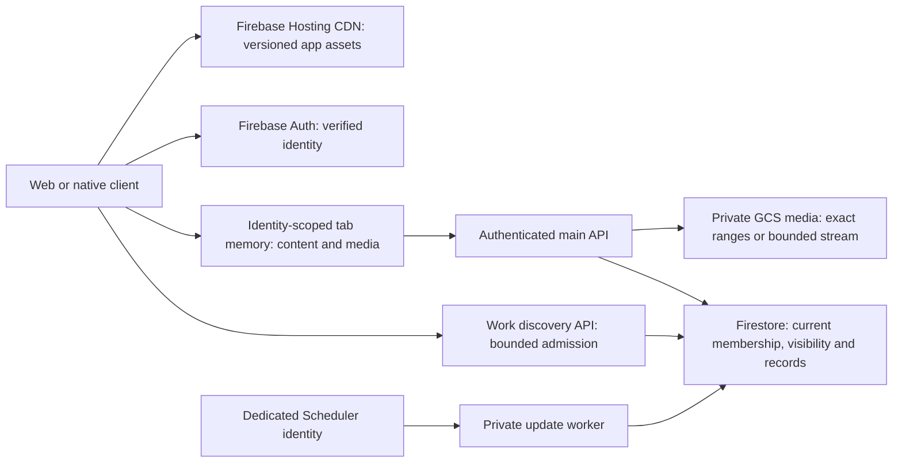

# Content delivery, cost and security architecture

This release reduces repeated content reads and media transfer, bounds API resource
use, and closes two direct Firestore permission gaps. It does not establish
million-user capacity or enable Cloud Armor. The sections marked **next rollout**
describe prerequisites for scaling beyond the current services.

## High-level delivery path

Hosting handles static asset caching. An API response is never made public merely
because its post is visible in a feed. Current membership, blocking, story expiry,
deletion and trial policy still determine access to protected media.

## Low-level browser and media behavior

| Layer | Implemented behavior | Cost or latency effect |
| --- | --- | --- |
| Hashed Vite `assets/**` | One-year immutable Hosting cache | Repeated visits reuse the same build assets; changed hashes fetch new assets. |
| App HTML at root and worker/admin routes | `no-cache, must-revalidate` on rewrite URLs | Navigation checks the current app build while hashed assets remain reusable. |
| Push service worker and brand manifest | Mutable files use `no-store` / fresh validation | A stale worker cannot retain obsolete account behavior for a year. |
| Content reads | Memory-only, 48-entry LRU, fixed 15-second monotonic lifetime | Concurrent reads share work; revisiting a fresh feed avoids an HTTP request. |
| Retained feed UI | Six source windows, original earliest page expiry retained | Remounting a view does not silently extend cached data's lifetime. |
| Media bytes | Memory-only, 64-entry LRU, 32 MiB total, 8 MiB per asset, fixed 60-second lifetime | Shared avatars and repeated visible content reuse a single fetch within the lifetime. |
| Visibility | Images/avatars load within 160 px of the viewport; video requires 15% viewport intersection | Offscreen video is not downloaded merely because a feed mounted. |
| Media response | `private, max-age=0, must-revalidate`; ETag; `Vary: Authorization, Cookie` | Authorized unchanged media can return 304 without resending its bytes. |
| Seeking | Exact authorized GCS/local byte ranges; full streams send 64 KiB chunks | Seeking no longer reads/transfers an entire 8 MiB clip. |
| State bootstrap | Frontend requests `/state?content=compact`; old full mode remains supported | Navigation state does not duplicate four feed lanes and four 200-row activity lanes. |

The content cache covers publication/feed/member reads. State, usage, inbox,
messages, notifications and job eligibility remain uncached. Successful commands
invalidate content. Profile, settings, blocking and deletion also retire media;
likes do not discard immutable media unnecessarily. Known authoritative access
changes or content denials retire private snapshots.

Feed freshness governs reuse on navigation and manual refresh. Compact 30-second
metadata refreshes do not continuously poll the full feed. Already rendered
captions remain a last-loaded snapshot until refresh, mutation or navigation;
the cache lifetime is not a real-time content delivery guarantee.

Firebase identity changes, sign-out, storage identity events and same-UID
sign-out/sign-in cycles advance an identity generation. Late results from the
previous generation cannot populate the next account's cache. Neither private
media nor feed records are placed in a service-worker cache, IndexedDB or a shared
CDN. Cancelling one observer does not cancel another observer's shared request.

Visible protected media revalidates at its original 60-second deadline and hides
expired bytes while checking. Hidden documents pause/release media; resuming
uses the original expiry. These are bounded freshness windows, not immediate
cross-device revocation. Every server request, including HEAD, Range and ETag
304, checks live authorization before exposing bytes or confirming the asset.

New uploads use the normalized content SHA for ETags. Legacy immutable objects
use their asset identity and size. GCS connections are reused within a workload,
new object generation is pinned during upload, and file/GCS readers close on
normal completion, errors and client disconnects. Existing 8 MiB / 20-megapixel
media validation remains in place.

A warm memory hit can render without network transfer. A cold image or video
still incurs identity verification, database access, object I/O, network and
decode time; millisecond delivery everywhere is not guaranteed.

## API resource boundaries

These are per-process controls, not a global DDoS service:

| Boundary | Default | Configuration |
| --- | --- | --- |
| Total request headers | 32 KiB | Fixed |
| JSON/default body | 1 MiB | `REPAIDO_HTTP_JSON_MAX_BYTES`, at most 8 MiB |
| Supported raw media/PDF body | 8 MiB | `REPAIDO_HTTP_MEDIA_MAX_BYTES`, at most 32 MiB |
| Concurrent raw uploads | 2 | `REPAIDO_HTTP_MAX_UPLOADS`, at most 16 |
| Body idle deadline | 15 seconds | `REPAIDO_HTTP_BODY_IDLE_SECONDS`, at most 120 seconds |
| Body total deadline | 120 seconds | `REPAIDO_HTTP_BODY_TOTAL_SECONDS`, at most 600 seconds |
| Main API active requests | 32 | `REPAIDO_API_MAX_INFLIGHT`, at most 512 |
| Main API waiting requests | 32, at most 100 ms waiting | `REPAIDO_API_MAX_WAITING`, at most 512 |
| Work API admission | Existing 64 active / 64 waiting controller | Independent work service controls |

Actual received bytes are counted, including chunked uploads. Invalid content
lengths, oversized headers/bodies, unsupported request compression and slow
body streams fail before expensive parsing. Admission overflow returns 503 with
`Retry-After: 1`; admission and upload slots release on cancellation and failures.
Health routes stay available during admission overload. Existing authorization
and stricter route limits remain authoritative: for example KYC PDF uploads
still require the worker role and retain their 5 MiB limit.

The work deployment sets 1 CPU / 512 MiB, minimum zero instances, a maximum of
20 discovery instances with concurrency 64 and two private-worker instances
with concurrency one. The main API deployment preserves its existing Cloud Run
configuration; its production instance maximum must be inspected before a
capacity or cost claim. Streaming requests hold admission until completion,
so increase limits only after measuring memory, decode CPU and stream duration.

## Identity, permissions and input handling

- Firestore administrator permission comes only from server-issued `admin` or
  `role=admin` Firebase custom claims. A matching email address is insufficient.
  Clients cannot mint signed custom claims. Owner-editable legacy `users` fields
  such as `role` do not change these claims or the canonical `ops_*` worker records.
- Firestore `support_tickets` retain owner/admin reads but prohibit direct
  writes. The legacy client helper now calls the authenticated idempotent server
  command and returns a confirmed ticket ID. Failures no longer become local
  fabricated success records. Native operations collections remain client-denied.
- Main API production identity comes from Firebase token verification with
  revocation checking; local SQLite session fallback is disabled in Firestore
  mode. Worker approval and commercial state use canonical backend records.
- SQLite values use bound parameters; the inspected dynamic field/projection
  paths use explicit allowlists. Regression tests store SQL-like strings as
  literal profile/record data and reject attempted field-name injection. This
  is targeted evidence, not a full penetration test.
- Existing local email/password sign-in permits at most 30 attempts per peer
  address in 15 minutes and checks the limit before password hashing. Tests
  verify the boundary, expiration and ignored untrusted forwarded addresses.
  This SQLite limiter is local to the main workload and does not limit Firebase
  OTP traffic or establish a distributed account/IP abuse policy.
- Main API CORS permits the configured Repaido web origins. Browser framing,
  MIME sniffing and referrer headers are hardened. The Hosting CSP restricts
  base/object/frame/form destinations on app pages; it deliberately does not
  claim a complete script allowlist. Firebase reserved authentication helper
  paths are excluded from the app's frame prohibition.

Phishing protection also depends on recognizable Repaido domains and verified
mail delivery. Before activating `support@repaido.com` SMTP notifications,
validate mailbox TLS and aligned SPF/DKIM/DMARC with the domain owner. Never send
passwords, bearer tokens or OTPs in confirmation mail. Existing external profile
links still need user judgment; this release does not claim domain reputation
screening or immunity to phishing.

## Next rollout: global abuse protection

The current Firebase Hosting `/api` rewrites and direct `run.app` callers are not
behind a configured Cloud Armor policy. Application admission limits reduce
resource amplification but cannot absorb or bill-protect a large global attack.

[The API edge Terraform module](../infra/api-edge/README.md) prepares the gateway,
private-backend routing and preview policies below. It has passed local source
and mock-provider checks but has not been applied. Its cPanel A-record output is
available only after the connected operator provisions the reserved address;
DNS, certificate activation and client/ingress cutover remain explicit stages.

Implement the edge rollout in this order in staging, then production:

1. Inventory web `/api` calls, native/direct Cloud Run calls, payment webhooks,
   health probes and authenticated Scheduler destinations. Reserve an API domain
   such as `api.repaido.com`, provision its managed certificate and DNS, and
   create a global external Application Load Balancer with serverless NEGs for
   the main API and discovery API. Keep the dispatch worker IAM-private.
2. Preserve current work-route dispatch and main API prefix behavior in the URL
   map. Route all supported clients through the edge hostname. Same-origin
   Firebase Hosting rewrites and older APK direct URLs otherwise bypass the
   policy; do not restrict origin ingress before replacing those paths and
   validating the supported-version transition.
3. Attach a Cloud Armor backend security policy to every public API backend.
   Start preconfigured SQLi/XSS rules and IP-based rate limits in preview,
   observe real traffic and shared mobile/NAT addresses, then enforce measured
   thresholds. Authenticate application commands independently of edge rules;
   never use a client-provided forwarding header as identity or trusted peer IP.
4. Verify browser CORS, Firebase token exchange, binary Range requests, signed
   payment webhooks, native apps and worker scheduling end-to-end. Only then set
   public APIs to `internal-and-cloud-load-balancing` ingress and remove unused
   direct-origin access using the supported Cloud Run configuration. Confirm
   direct external requests are denied and the edge continues to work.
5. Alert on edge denies/rate violations, API 401/403/408/429/503, latency and
   egress. Document rollback for URL maps, policy enforcement and ingress.

Do not place the existing authorization-dependent media responses in a public
CDN. A future public-media projection requires explicit publication consent,
immutable versioned object paths, deletion/revocation behavior and a separate
privacy policy. A shared Redis cache or always-on instance also needs a measured
benefit before accepting its standing cost.

## Next rollout: remove scaling bottlenecks

The main API's lifespan still runs legacy `operations_tick` every 30 seconds
**on each API instance**. Its sweep walks broad jobs/lifecycle/rental and other
record pools. Autoscaling the API therefore duplicates background reads/work.
The private work-update worker uses bounded due work, but it does not replace
this legacy sweep. Cache improvements do not solve this bottleneck.

Before increasing main API autoscaling substantially, migrate the sweep to an
authenticated scheduled worker: index due timestamps and stable shard keys,
query a bounded due batch with keyset continuation, and acquire transactional
leases with idempotent command/event IDs. Compare candidate actions in a
read-only shadow run, test deadline/payment retries and crash recovery, then
disable the per-API loop only after coverage is established. Avoid global
collection scans or one scheduled function per user.

Nearby hiring still has cross-city/online worker scans and large city pools.
Use materialized city/category/geospatial candidate cohorts with bounded
queries, exact eligibility rechecks and controlled backfill before a
million-worker deployment. See [hiring discovery limits](HIRING_SEARCH.md).
The content/member paths now avoid unnecessary feed hydration and bound lazy
legacy migration; other domain-wide scans need their own query review.

## Capacity and cost gates

Measure a staging workload with representative profile counts, media sizes,
followers and city/category skew. Exercise cold and warm feed visits, story
expiry, viewport scrolling, video seeking, account switches, blocking/deletion,
permission failures, recent job eligibility and retry storms. Increase
concurrency gradually; record p50/p95/p99 latency, first visible media time,
Firestore reads per action, bytes, cache hits, CPU/memory, cold starts and
admission rejections. An isolated SQLite load harness is not evidence of
production Firestore capacity.

Set user-experience SLO targets before selecting instance/concurrency limits;
verify them against measured results. Make every release pass revocation and
identity-race tests, not only throughput checks. No million-user load test has
been performed for this change.

Estimate recurring cost from measured factors:

`active users × actions per user × uncached requests per action × reads per request`

Then add object-operation/egress bytes, Cloud Run CPU/memory time, logging,
Scheduler and any new edge-policy/load-balancer charges. An ETag 304 removes
repeat bytes but still performs live authorization reads. A warm tab-memory
hit avoids both the API request and those reads within its fixed freshness
window. Track these separately instead of treating every cache hit as free
server work. Configure budget alerts and retained-log limits based on the
project's actual spend; inspect the busiest cohorts and cost per active user
before adding standing infrastructure.

## Verification in this release

The real API/browser comparison against `ae2c20f` used the same isolated records
and media in both versions. A documented 400 ms delivery hold exercised concurrent
subscribers; it does not measure normal network latency.

| Scenario | Previous release | This release |
| --- | ---: | ---: |
| Concurrent downloads of one shared photo | 12 | 1 |
| Feed requests across three warm Home/Works round trips | 5 | 0 |
| Response bytes during 31 idle seconds | 17,119 | 2,698 |
| Compact state response bytes | 9,492 | 1,981 |

An externally revoked mounted photo made one live authorization check at expiry,
hid its old bytes during the check and remained hidden after the server's 404.
Hidden consumers made no expiry request. These fixtures demonstrate fewer reads
and transferred bytes; they do not measure production cost or capacity.

- Real ASGI tests cover declared/chunked body boundaries, genuine large KYC PDF
  acceptance plus guest/customer denial, overload, cancellation, streaming,
  slow-upload deadlines and preserved private ETag headers.
- The actual local Firestore emulator tests public reads, owner isolation,
  email/profile-role escalation denial, custom-claim administration and denied
  ticket/native-operation direct writes. CI runs the same demo-project checks.
- Rule publisher tests cover IAM preflight, unchanged-source reuse, compiler
  source mismatch, wrong-project/release identity and failed activation.
- The local Hosting emulator verifies app-page policy, reserved auth-path
  exceptions, immutable assets and mutable service-worker headers. This checks
  headers, not a real SMS/OAuth flow.
- Browser cache and media tests measure repeat requests and bytes and exercise
  account/mutation/expiry races. These results support this change's bounded
  behavior; they do not establish global DDoS resistance or million-user scale.
