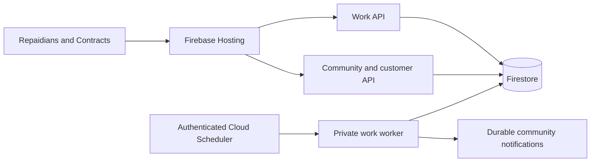

# Repaidians work discovery and application services

The work API and update worker are independently startable services. They reuse
the existing Firebase identity verifier and transactional records adapter, but
mount their own routes and never run the customer API's operational scheduler.
Public Firebase Hosting transport still requires the identity and ownership
checks on each private work request. The worker is private at both Cloud Run IAM
and application layers.

## Responsibilities and request flow

| Component | Responsibility | Transport and ownership |
| --- | --- | --- |
| Customer/community API | Profiles, media, follows, community notifications, authoritative native contracts, project records and application commands/progress | Existing `repaido-api`; existing identity and role checks |
| Work API | Relevant work discovery, ready-for-work matching, work preferences, company pages, shared placement details and congratulations | `repaido-work-api`; `/repaidians/work`, `/repaidians/companies`, `/repaidians/placements` routes and health |
| Work update worker | Bounded discovery/update delivery, persistent delivery state and retries | `repaido-work-worker`; authenticated Scheduler request only |
| Firebase Hosting | Same-origin public app and route dispatch | Specific work rewrites precede the generic `/api/**` rewrite |
| Firestore | Durable native records, work projections, applications, delivery and notification state | Shared record ownership during migration; writes stay transactional |



The first migration boundary deliberately shares storage. This is a service
deployment boundary, not a claim that every legacy domain already has a separate
database. Native contracts remain authoritative; discovery indexes are projections
and cannot grant access to private contract scopes or override ownership.

## Local commands

Run from `backend` with the existing virtual environment and a local SQLite DB:

```sh
REPAIDO_STORAGE=sqlite REPAIDO_DB=/tmp/repaido-work-dev.db \
  .venv/bin/uvicorn work_service:app --host 127.0.0.1 --port 8001
REPAIDO_STORAGE=sqlite REPAIDO_DB=/tmp/repaido-work-dev.db \
  .venv/bin/uvicorn work_worker:app --host 127.0.0.1 --port 8002
```

If the virtual environment is at repository root, use `../.venv/bin/uvicorn`.
Health requests are `GET /health`. The API also accepts Firebase Hosting's `/api/`
prefix. The worker's `POST /internal/work/dispatch` fails closed unless its exact
OIDC audience and Scheduler account are configured. No development auth bypass,
public worker token or embedded secret is provided.

## Cloud Build and deployment integration

Use the same tested immutable backend image for all three services and add
`work_runtime.py`, `work_service.py`, `work_worker.py`, `work_push.py`, and `repaidians_work.py` to
the Docker image. Each work service overrides the container command:

```sh
gcloud run deploy repaido-work-api --project=repaido --region=us-central1 \
  --image="$WORK_IMAGE" --service-account="$WORK_RUNTIME_ACCOUNT" \
  --command=uvicorn \
  --args=work_service:app,--host,0.0.0.0,--port,8080,--no-proxy-headers \
  --set-env-vars=REPAIDO_STORAGE=firestore,GOOGLE_CLOUD_PROJECT=repaido,REPAIDO_BUILD_ID="$WORK_BUILD_ID" \
  --concurrency=64 --cpu=1 --memory=512Mi --timeout=60 \
  --min-instances=0 --max-instances=20 --allow-unauthenticated

gcloud run deploy repaido-work-worker --project=repaido --region=us-central1 \
  --image="$WORK_IMAGE" --service-account="$WORK_RUNTIME_ACCOUNT" \
  --command=uvicorn \
  --args=work_worker:app,--host,0.0.0.0,--port,8080,--no-proxy-headers \
  --set-env-vars=REPAIDO_STORAGE=firestore,GOOGLE_CLOUD_PROJECT=repaido,REPAIDO_BUILD_ID="$WORK_BUILD_ID",REPAIDO_PUSH_ENABLED=true \
  --concurrency=1 --cpu=1 --memory=512Mi --timeout=240 \
  --min-instances=0 --max-instances=2 --no-allow-unauthenticated
```

The runtime account must have the Firestore and Firebase Auth read permissions
already required by the existing API. Do not substitute a human account, upload
a service-account key, or create an ephemeral SQLite production instance. Preserve
any existing payment/trial settings required by community access checks using
the existing service configuration; do not print those values in build logs.

Cloud Build should deploy and verify both candidate services before changing
Hosting. Health must report the current build ID and `storage: firestore`. Then
place these rewrites before `/api/**`:

```json
[
  {"source":"/api/repaidians/work","run":{"serviceId":"repaido-work-api","region":"us-central1"}},
  {"source":"/api/repaidians/work/**","run":{"serviceId":"repaido-work-api","region":"us-central1"}}
]
```

The company and placement exact paths and subpaths also route to the work API.
The worker is never added to Hosting. Scheduler uses a dedicated caller account
with `roles/run.invoker` on the worker only. The account used to create the
Scheduler job must be allowed to act as this caller. The Scheduler service agent
must retain its standard service-agent role. Enable the Cloud Scheduler API if
it is not already enabled.

```sh
WORK_CALLER=repaido-work-scheduler@repaido.iam.gserviceaccount.com
WORK_URL="$(gcloud run services describe repaido-work-worker --project=repaido \
  --region=us-central1 --format='value(status.url)')"
gcloud run services update repaido-work-worker --project=repaido --region=us-central1 \
  --update-env-vars="REPAIDO_WORK_WORKER_AUDIENCE=$WORK_URL,REPAIDO_WORK_SCHEDULER_EMAIL=$WORK_CALLER"
gcloud run services add-iam-policy-binding repaido-work-worker --project=repaido \
  --region=us-central1 --member="serviceAccount:$WORK_CALLER" --role=roles/run.invoker
gcloud scheduler jobs create http repaido-work-updates --project=repaido \
  --location=us-central1 --schedule='* * * * *' --time-zone=Asia/Kolkata \
  --uri="$WORK_URL/internal/work/dispatch" --http-method=POST \
  --oidc-service-account-email="$WORK_CALLER" --oidc-token-audience="$WORK_URL" \
  --headers=Content-Type=application/json --message-body='{"limit":40}' \
  --attempt-deadline=240s --max-retry-attempts=3 --min-backoff=30s --max-backoff=300s
```

For a job that already exists, use `gcloud scheduler jobs update http` with the
same settings. Running once per minute is delivery cadence; per-member
daily update limits and opt-in checks belong in the durable worker, not in a
client timer. Each update queue processes at most 40 references per invocation;
each FCM relay sends at most 64 messages with a 30-second soft scheduling budget
and a 10-second provider HTTP timeout. Work remains durable if a run ends early.
`scripts/deploy-work-services.py` implements repeatable candidate deployment,
secure runtime configuration inheritance, account/job creation, verification and
promotion for Cloud Build. The commands above show the same service boundaries.
Send Scheduler's token through `Authorization`, not `X-Serverless-Authorization`:
Cloud Run removes the signature on the latter before forwarding it, which would
prevent the additional application signature verification.

## Reliability and access boundaries

- Work API admission defaults to 64 in-flight requests and 64 waiting requests
  per process. Queue wait is at most 100 ms; overload returns HTTP 503 with
  `Retry-After`. Clients keep prior results, back off with jitter and do not
  relaunch a full-screen loader. Limits are configuration, not capacity evidence.
- Worker concurrency is one locally and at Cloud Run. Deterministic notification
  keys and per-recipient daily budgets commit in the same transaction. FCM uses
  durable leases and per-device receipts, rechecks eligibility before each send,
  retries with exponential backoff and disables invalid tokens only if the token
  has not been replaced. The indexed due queue excludes terminal rows and future
  retries before applying the page limit. A process crash after FCM acceptance and
  before its receipt commits can repeat a push: clients deduplicate its stable
  notification ID and Android replaces the same notification tag. This is
  at-least-once transport, not a false exactly-once promise.
- Firestore transactions must finish all reads before calling native transaction
  writes. `operations.Unit.put` buffers writes until `flush`; independent reads
  should be prefetched in bounded batches. Never call a nested store transaction
  from inside another transaction callback.
- A page is bounded. Historical migrations use persistent cursors and bounded
  batches; a partially indexed dataset must not silently claim exhaustive results.
  Public discovery cannot invoke `Unit.all` across every member or contract.
- Account-specific response caches and continuation cursors bind the account,
  filter set, profile revision and algorithm version. Clear them on sign-out,
  identity changes and relevant status changes. A cached public card is still
  revalidated against the authoritative listing before an application or hire.
- Status transitions use server ownership and optimistic versions. Retry keys
  identify the same application command; ties use application time followed by a
  stable ID. Ranking is a decision aid, never an automatic unauthorized hire.
- Sharing a placement, exact location or compensation with followers requires
  explicit member choice. Notification detail access must re-check audience,
  block state and current visibility instead of trusting a deep link.
- An FCM token may be transferred between accounts on the same device. Its
  canonical account/device ownership is checked when selecting a recipient and
  again before every send. Device migration cannot overwrite newer live ownership;
  historical deliveries wait for migration completion. A stale invalid-token
  receipt cannot disable a replacement token or a newly owning account. The push
  envelope includes its recipient account for client-side rejection of queued
  messages after identity changes; lock-screen content remains generic.

## Capacity validation and next scale gates

“10,000 concurrent users”, “10,000 requests per second”, and “100,000 new users
per second” are different workloads. This change does not certify those numbers.
Request rate is concurrent active users multiplied by their request frequency.
Store demand is request rate multiplied by measured reads/writes per request,
plus worker indexing and notification delivery. A request that reads 40 documents
at 100,000 requests/s implies four million document reads/s before retries; page
bounds do not remove that cost.

The checked-in bounded load harness uses a temporary SQLite dataset and real
HTTP requests to the independently running work API. It records concurrency,
duration, status counts, p50/p95/p99 latency and throughput. It refuses production
storage and never seeds production Firestore. SQLite serializes write transactions
and is useful for correctness and local regression evidence; those numbers do
not predict distributed Firestore or Cloud Run throughput.

Reproduce the local checks from repository root:

```sh
backend/.venv/bin/python scripts/work_api_load.py --concurrency=8 --duration-seconds=10 --output=/tmp/work-c8.json
backend/.venv/bin/python scripts/work_api_load.py --concurrency=32 --duration-seconds=10 --output=/tmp/work-c32.json
backend/.venv/bin/python scripts/work_api_load.py --concurrency=64 --duration-seconds=10 --output=/tmp/work-c64.json
cd backend
.venv/bin/python -m pytest -q test_work_service.py test_work_push.py test_repaidians_work.py
```

Observed on 2026-10-07, Python 3.12.14, a shared development host reporting five
CPUs, 16 authenticated local accounts and 160 temporary native project records:

| Concurrent requests | Completed HTTP 200 | Observed requests/s | p50 ms | p95 ms | p99 ms | Correctness/transport failures |
| ---: | ---: | ---: | ---: | ---: | ---: | ---: |
| 8 | 1,531 | 151.49 | 16.40 | 200.38 | 741.96 | 0 |
| 32 | 1,864 | 181.97 | 30.54 | 939.06 | 1,872.34 | 0 |
| 64 | 1,164 | 110.57 | 296.20 | 1,995.33 | 3,431.45 | 0 |

All 4,559 completed requests used the correct account's trade and excluded private
site/scope data. Increased SQLite contention visibly hurts tail latency at 64
requests; this is a measured limitation, not “zero latency”. Each run targeted ten
seconds and allowed in-flight requests to finish. The test is a bounded regression
check, not an endurance test or a production load certificate. At launch, the
single scheduled recipient lane is limited to 40 references/minute; shard and
queue delivery before promising prompt updates to large audiences.

Before raising production scale limits:

1. Replay measured representative discovery, application and profile workloads
   in an isolated GCP project with the same indexes, latency and Auth settings.
2. Measure warm and cold instances separately, personalized cache hit ratio,
   document reads/writes, transaction retries, p95/p99 and 429/503 rates.
3. Set and validate read/write cost budgets, Firestore and Auth quotas, service
   instance ceilings and any shared-cache capacity. Do not increase Cloud Run
   instances past the datastore's measured sustainable rate.
4. If ranking traffic exceeds bounded projection reads, introduce an independently
   refreshed search index and shared short-lived cache; maintain authoritative
   revalidation for applies/offers and isolate cache keys by identity/revision.
5. Partition scheduled audiences by stable account hash, instrument backlog age,
   shard hot counters, and move delivery to bounded Cloud Tasks batches before a
   single Scheduler run exceeds its deadline. Retry exhausted tasks must retain
   a visible failed state for recovery.

Candidate launch gates: no private-data leaks or duplicate durable notifications;
push replays deduplicated by their stable notification IDs; less than
1% overload/error rate at the approved steady load; no increasing worker backlog;
p95 warm discovery below the product's agreed budget. These are gates to measure,
not claimed production results.
